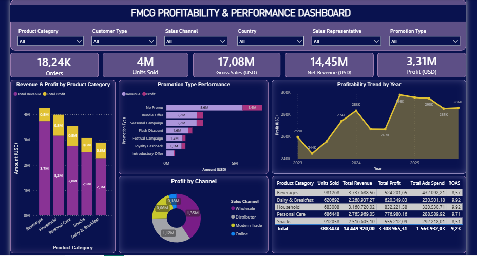

</img>

# FMCG Profitability Analysis
FMCG Performance & Profitabilty Analysis

The project is to analyze Profitability Analysis in FMCG company.

# Data Source
The dataset used in this project was sourced from Kaggle:

**Dataset:** [FMCG Sales & Profit Dataset](https://www.kaggle.com/datasets/atharvasoundankar/fmcg-sales-marketing-and-profit-data)  
**Source:** Kaggle

# Data Processing
- Cek missing value
- Cek duplikat data
- EDA
- Investigate loss-making transactions and profitability, marketing spend efficiency, promotion effectiveness, and customer segmentation.
- Transformed data using Power BI before creating dashboard
